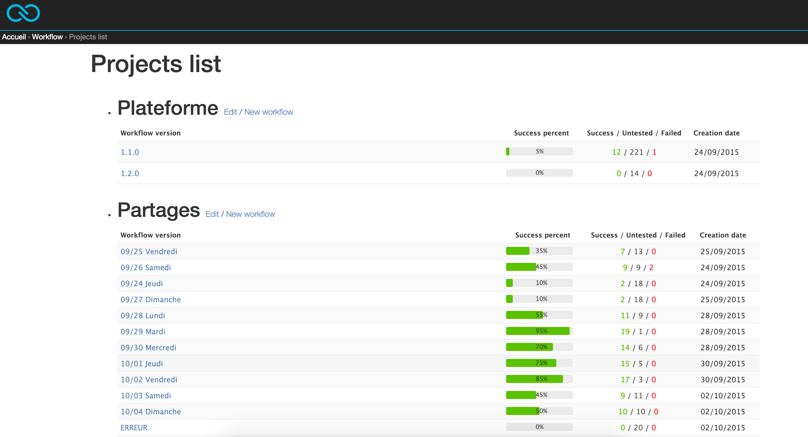

*Disclaimer : Work in progress*

# Workflow

Small internship project to keep a list of items to check when a new release is beeing tested.

-----

# Todo

* renommer en anglais (wip)
* vues user : login, logout, ... (wip)
* permissions (wip)
* more doc
* more tests (especially ajax and permissions)

# Setup

Standard django setup :
* virtualenv: `virtualenv workflow-env`
* requirements: `pip install -r requirements.txt`

Don't forget to build the css :

    ./tools/build_css.sh

Syncdb :
If you use the plain django's command `syncdb`, you will need to create a Person instance for the django's superuser. You should use the following script which create a superuser/password admin/admin  :

    ./scripts/resetdb.py

Fill db with fake data :

    ./scripts/fake_data.py

# Dev tools

Run tests :

    ./manage.py test

Run coverage :

    coverage erase
    coverage run ./manage.py test
    coverage html

Dump db to json :

    ./manage.py dumpdata APP --format=json --indent=4 > workflow/apps/APP/fixtures/APP.json

